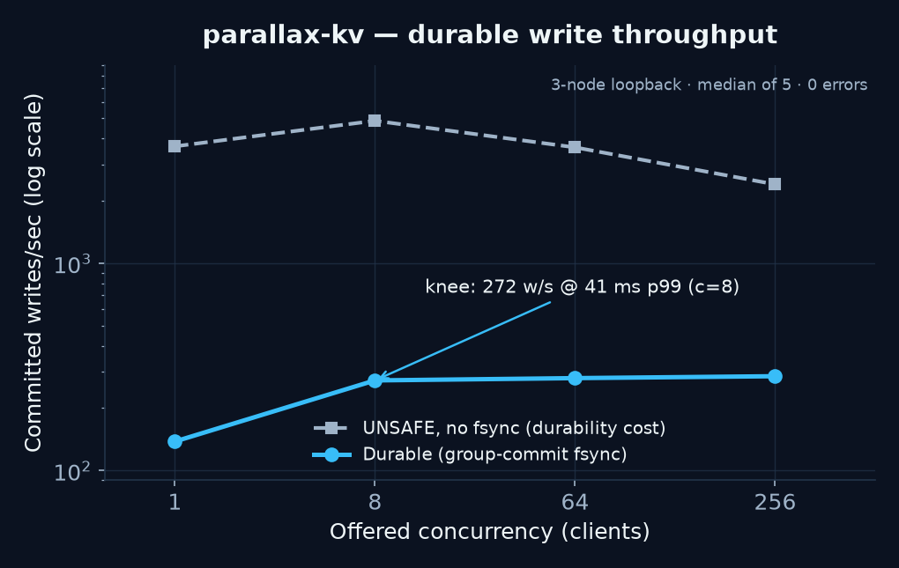

# parallax-kv

[](https://github.com/iwang-1/parallax-kv/actions/workflows/ci.yml)
[](.golangci.yml)
[](LICENSE)

parallax-kv is a replicated key-value store in Go with a from-scratch Raft
core, a durable gRPC runtime, and a deterministic fault simulator. The same
consensus state machine runs under both real I/O and virtual time, so a failed
simulation can be replayed from its scenario and seed.

Implemented scope: one static Raft group with leader election, PreVote, log
replication, the Figure-8 commit rule, ReadIndex, exactly-once command apply,
segmented WAL recovery, snapshots, and leader-to-follower `InstallSnapshot`.
This is a systems project with explicit test evidence, not a production-ready
database.

## Results at a glance

- **Consistency soak:** 200 seeds x 7 fault scenarios = **1,400 scenario
  runs** and **2,914,245 completed client operations**, with zero per-step
  invariant violations and zero Porcupine `Illegal` verdicts. See
  [CONSISTENCY_REPORT.md](CONSISTENCY_REPORT.md).
- **Durable write knee:** **272 writes/s at 41 ms p99** with 8 closed-loop
  clients on a three-process localhost cluster.
- **Crash path:** CRC32C-framed WAL records, torn-tail truncation, atomic
  snapshot files, and persist-before-send ordering.
- **Honest bug accounting:** the soak found zero consensus bugs. A harness
  failure was traced to an election-safety checker that used a stale
  applied-entry term as a proxy for the node's current term; the checker was
  fixed to read the real Raft term. See
  [docs/BUG_LEDGER.md](docs/BUG_LEDGER.md).

## Architecture

```text
                         real runtime
 parallaxctl / Go client -------------> gRPC KV service
       leader redirects                       |
                                              v
                                      single drive loop
                                    Tick / Step / Ready
                                              |
                         +--------------------+--------------------+
                         |                    |                    |
                         v                    v                    v
                  pure Raft core       KV state machine      peer gRPC
                         |
                         v
              segmented WAL + snapshots
              persist -> send -> apply -> Advance

                       deterministic runtime
 seeded workload + virtual clock + fault network
                         |
                         v
                  the same Raft core
                         |
                         v
       safety invariants + Porcupine histories + replay trace
```

The `/raft` package has no goroutines, wall clock, or I/O. A driver serializes
all inputs and effects through the `Ready`/`Advance` contract:

1. Persist hard state, entries, and snapshots; fsync when `MustSync` is set.
2. Send dependent Raft messages.
3. Apply committed entries and release confirmed reads.
4. Call `Advance`.

That ordering prevents a node from sending a vote or replication promise that
it can forget after a crash. The real `/server` driver uses disk and gRPC; the
`/sim` driver uses a seeded event queue and virtual time.

## Quickstart

Requirements: Go 1.24 or newer. Generated protobuf files are committed, so
`protoc` is not required.

```sh
git clone https://github.com/iwang-1/parallax-kv.git
cd parallax-kv

go test ./...

mkdir -p bin
go build -o bin/parallaxd ./cmd/parallaxd
go build -o bin/parallaxctl ./cmd/parallaxctl
```

Start a local three-node cluster:

```sh
PEERS="1=localhost:7101,2=localhost:7102,3=localhost:7103"
CLIENTS="1=localhost:8101,2=localhost:8102,3=localhost:8103"
DATA_DIR="$(mktemp -d)"

for id in 1 2 3; do
  ./bin/parallaxd \
    --id "$id" \
    --peers "$PEERS" \
    --client-peers "$CLIENTS" \
    --data-dir "$DATA_DIR/node-$id" \
    --listen "localhost:$((8100 + id))" \
    >"$DATA_DIR/node-$id.log" 2>&1 &
done

sleep 3
```

The client follows leader redirects automatically:

```sh
CLUSTER="localhost:8101,localhost:8102,localhost:8103"

./bin/parallaxctl --cluster "$CLUSTER" put account:42 active
./bin/parallaxctl --cluster "$CLUSTER" get account:42
./bin/parallaxctl --cluster "$CLUSTER" cas account:42 active suspended
./bin/parallaxctl --cluster "$CLUSTER" del account:42
```

## Correctness evidence

The deterministic simulator runs a three-node cluster with concurrent
Get/Put/Delete/CAS workloads while injecting leader partitions, minority
partitions, crash/restart loops, 30% message loss, duplication and delay,
mixed faults, and snapshot catch-up after a partition.

After every simulated step it checks:

- election safety;
- log matching;
- leader completeness; and
- applied-prefix agreement.

At the end of each run, Porcupine searches the observed operation history for
a legal single-copy execution. Every failure includes a scenario and seed:

```sh
go test ./sim -run 'TestScenarioReplay$' \
  -scenario=mixed-chaos -seed=0x1234 -count=1 -v
```

The main local/CI gates are:

```sh
go test ./... -race -count=1 \
  -skip 'TestScenario(Soak|Determinism)$'

go test ./sim -run 'TestScenarioDeterminism$' \
  -det-lo=0 -det-hi=10 -count=1 -v

go test ./sim -run 'TestScenarioSoak$' -timeout 10m \
  -soak-lo=0 -soak-hi=25 -count=1 -v
```

The full 200-seed result, exact batch counts, checker semantics, and
non-vacuity statement are in
[CONSISTENCY_REPORT.md](CONSISTENCY_REPORT.md). This is strong empirical
evidence under a defined fault model, not a formal proof.

## Durable benchmark

Three local OS processes, 16-byte keys, 128-byte values, 1,000-key space,
5-second discarded warmup, 30-second measured window, five repetitions per
cell. Values below are medians for the default durable mode, which fsyncs all
records in each write-bearing `Ready` batch before sending dependent messages.



| Closed-loop clients | Median writes/s | Median p99 |
|---:|---:|---:|
| 1 | 138 | 7.8 ms |
| 8 | **272** | **41 ms** |
| 64 | 279 | 352 ms |
| 256 | 285 | 991 ms |

Throughput is effectively flat beyond 8 clients while queueing latency grows,
so C=8 is the useful knee rather than the maximum-throughput row. A separate
4 KiB probe on the WAL filesystem measured approximately **0.89 ms fsync
p50**. Benchmark numbers are host-specific; CI only smoke-tests the real
three-node path and makes no throughput assertion.

Full methodology, the read and unsafe controls, and raw output are in
[benchmarks/RESULTS.md](benchmarks/RESULTS.md) and
[`benchmarks/raw/`](benchmarks/raw/). `--unsafe-no-fsync` exists only to
measure the durability barrier's cost and can lose acknowledged writes.

## Design boundaries

- This is one static Raft group. There is no sharding or online membership
  change.
- Leaders append a current-term no-op, but `MsgReadIndex` is not explicitly
  gated on that entry becoming committed. Adding that gate is a remaining
  correctness-hardening item for newly elected leaders.
- The production loop drains after each client request; it has a `Ready`-level
  fsync boundary but does not deliberately coalesce multiple leader proposals.
- Snapshot compaction scheduling is implemented in the simulator, but is not
  wired into the production `/server` runtime. Disk snapshot persistence and
  restore are implemented and unit-tested.
- `InstallSnapshot` sends the complete snapshot in one message; chunked
  snapshot streaming is not implemented.
- The gRPC runtime has no TLS, authentication, admission control, or
  operational control plane.
- Porcupine's search is bounded. `Illegal` is a violation; `Unknown` is
  inconclusive and is not treated as a failure. The soak output currently
  records violations and operation counts, not the `Ok`/`Unknown` split.
- Benchmarks are single-host localhost measurements, not multi-region or
  sharded-database results.

The rationale and tradeoffs behind PreVote, Figure-8, ReadIndex, group commit,
simulation, and snapshots are documented in
[docs/DESIGN_NOTES.md](docs/DESIGN_NOTES.md).

## Repository map

| Path | Responsibility |
|---|---|
| `raft/` | Pure deterministic Raft state machine |
| `server/` | Real-time drive loop and client gRPC service |
| `transport/grpc/` | Peer message transport |
| `storage/disk/` | Segmented WAL, recovery, and snapshot files |
| `kv/` | Replicated KV state machine and session deduplication |
| `sim/` | Virtual clock, network, faults, invariants, and Porcupine adapter |
| `cmd/` | Server, CLI client, and benchmark binaries |
| `e2e/` | Real-process leader-failover test |
| `benchmarks/` | Methodology and committed raw measurements |

License: [MIT](LICENSE)
